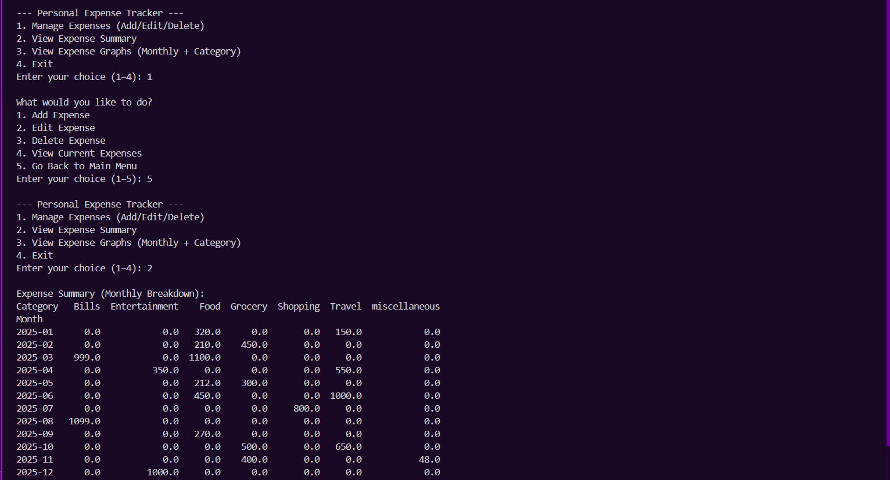
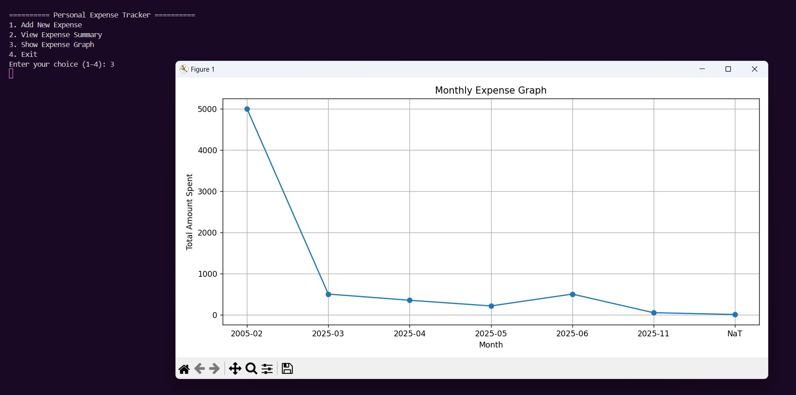

# 💸 Personal Expense Tracker App  
A beginner-friendly, terminal-based Python app to **track, edit, and visualize** personal expenses. A great starter project for aspiring data analysts!

## 🚀 Features  
- Add daily expenses with **date, category, amount, and description**  
- Edit or delete previously added expenses  
- Automatically saves and updates data in `expenses.csv`  
- View total, category-wise, and monthly summaries using **Pandas**  
- Visualize:
  - **Monthly spending trends** with line graphs  
  - **Category-wise distribution** using pie charts  

## 🛠️ Tech Stack  
- Python  
- Pandas  
- Matplotlib  
- CSV File Handling  

## 📸 Screenshots  
### 🧾 Main Menu  
  

### 📊 Monthly Expense Graph & Category-wise Pie Chart
  

## 📂 Folder Structure  
<pre> expense-tracker/
├── tracker.py             # Main Python script
├── expenses.csv           # Expense records (auto-created)
├── screenshot-menu.png    # CLI Screenshot (optional)
├── screenshot-graph.png   # Graph Screenshot (optional)
└── README.md              # Project documentation </pre>

## 🧠 What I Learned  
Through this project, I gained hands-on experience with:  
- Writing clean and modular Python code  
- Working with file input/output using the CSV module  
- Aggregating and analyzing data using **Pandas**  
- Visualizing insights through **Matplotlib**  
- Building interactive, menu-driven CLI applications  
- Implementing edit/delete functionality for real-world usability  

---

## 🚧 Limitations  
- Data is stored locally in `.csv` format only  
- No persistent database or login system  
- Graphs currently limited to **monthly totals** and **category breakdowns**  

---

## 🌱 Future Improvements  
- Export summary reports to Excel or PDF  
- Build a GUI version using **Tkinter** or **Streamlit**
