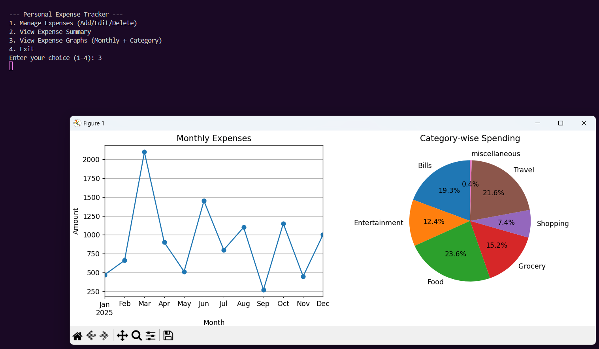

# 💸 Personal Expense Tracker App
A beginner-friendly, terminal-based Python app to track and visualize personal expenses. Great first project for aspiring data analysts!

## 🚀 Features
- Add daily expenses with date, category, amount, and description
- Automatically saves to `expenses.csv`
- View total, category-wise, and monthly expense summaries using **Pandas**
- Plot monthly expense trends using **Matplotlib**

## 🛠️ Tech Stack
- Python
- Pandas
- Matplotlib
- CSV File Handling

## 📸 Screenshots
### 🧾 Main Menu  

### 📊 Monthly Expense Graph  

## 📂 Folder Structure
<pre> expense-tracker/
├── tracker.py             # Main Python script
├── expenses.csv           # Expense records (auto-created)
├── screenshot-menu.png    # CLI Screenshot (optional)
├── screenshot-graph.png   # Graph Screenshot (optional)
└── README.md              # Project documentation </pre>

## 🧠 What I Learned
As a beginner in Python and Data Analysis, this project taught me:
- Writing structured Python code and functions  
- Handling file I/O using the CSV module  
- Performing data aggregation with Pandas  
- Creating visual insights using Matplotlib  
- Designing menu-driven CLI apps

---

## 🚧 Limitations
- Data is stored locally in `.csv` format only  
- No persistent database or login system  
- Graph shows only **monthly totals**

---

## 🌱 Future Improvements
- Allow editing/deleting of expense entries  
- Add category-wise pie chart visualization  
- Export summary to Excel or PDF  
- Build a GUI using **Tkinter** or **Streamlit**
